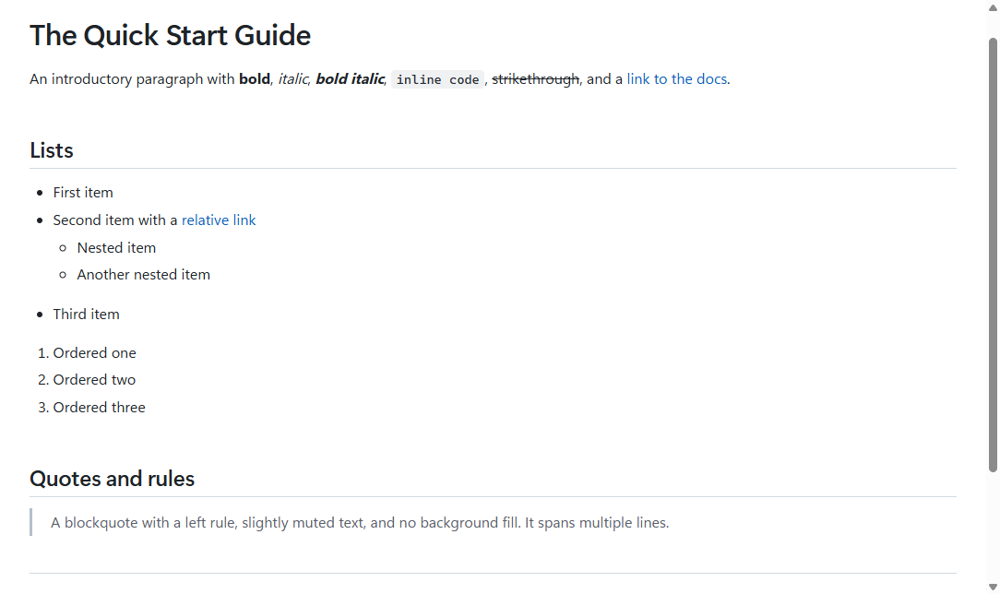
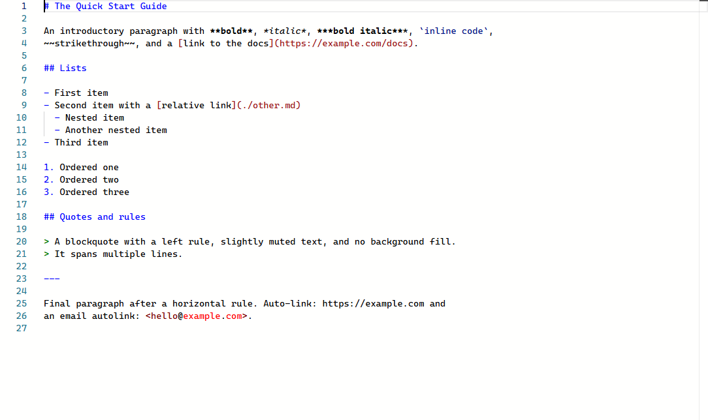

# mdreader

**A fast, beautiful markdown reader for Windows — that happens to edit.**

Double-click a `.md` file, see a well-typeset document in under a second, press
`Ctrl+E` to edit the raw markdown, `Ctrl+S`, back to reading. Nothing else. No
vault, no notebook, no sync, no account.



## Features

- **Reader first.** A calm, readable document view with real typographic
  hierarchy, light and dark themes that follow Windows, and WCAG AA contrast.
  Content follows the window width by default; a classic centered
  ~72-character reading column is one setting away.
- **CommonMark + GFM** via Markdig: tables (pipe and grid), task lists,
  footnotes, definition lists, strikethrough, sub/superscript, abbreviations,
  citations, custom containers, YAML front matter (rendered as a collapsed
  metadata card), emoji shortcodes.
- **Code, diagrams, math.** highlight.js syntax coloring with a hover copy
  button, Mermaid diagrams (graceful inline errors, never a blank space), and
  KaTeX math — all bundled, all offline.
- **Source mode.** `Ctrl+E` toggles to a Monaco editor with markdown
  highlighting; scroll position is preserved in both directions. `Ctrl+Shift+E`
  for split view with synchronized scrolling.
- **Faithful saves.** Encoding, BOM, and line endings are detected on open and
  round-tripped byte-for-byte — your Git diffs stay clean.
- **Live reload.** Files changed on disk reload in place (debounced); if you
  have unsaved edits you choose Reload or Keep mine.
- **Navigation.** Collapsible table of contents with keyboard support,
  `Ctrl+G` go-to-line-or-heading, back/forward through jumps
  (`Alt+Left`/`Alt+Right`), and every file reopens at the spot you left it.
- **Safe editing.** Atomic saves, visible dirty markers, one clear review of
  all unsaved documents on close, and crash recovery that offers your unsaved
  edits back on the next launch — without ever touching the file on disk.
- **Reading info.** Unobtrusive word count, estimated reading time, and
  progress in the status bar.
- **Single instance with tabs**, drag & drop, recent files, find in both modes,
  zoom that persists.
- **Export**: self-contained HTML (diagrams and math pre-rendered, images
  embedded), PDF, print, and copy-as-rich-text that pastes cleanly into Word
  and Outlook.
- **Scriptable**: `mdreader file.md --export-html out.html` and
  `--export-pdf out.pdf` work headlessly for CI.

## No telemetry. Ever.

mdreader makes no network requests of any kind, with two explicit, visible
exceptions you control: loading remote images (off by default — they are a
tracking vector) and an opt-in update check against the GitHub releases API
(also off by default). There are no analytics, no crash reporting phone-home,
no usage beacons. This is enforced in code, not just promised here: the reader
runs under a Content Security Policy with `connect-src 'none'`.

## Install

**winget** (recommended):

```powershell
winget install recherchesolutions.mdreader
```

**Installer**: download `mdreader-setup-<version>.exe` from
[Releases](../../releases). Per-user, no admin required. Silent install for
Intune/SCCM: `mdreader-setup.exe /VERYSILENT /NORESTART`.

**Portable**: download `mdreader-<version>-portable-win-x64.zip`, extract, run
`mdreader.exe`. No installer, no registry writes until first launch (the app
registers itself per-user as an *available* handler — never the default
without your say-so).

**Build from source**:

```powershell
git clone https://github.com/recherchesolutions/mdreader
cd mdreader
dotnet build -c Release
dotnet run --project src/MdReader.App -c Release -- path\to\file.md
```

Requires the .NET 10 SDK and the WebView2 Evergreen Runtime (preinstalled on
Windows 11 and any machine with Edge).

## Keyboard

| Key | Action |
|---|---|
| `Ctrl+E` | Toggle Reader ⇄ Source |
| `Ctrl+Shift+E` | Toggle split view |
| `Ctrl+Shift+O` | Table of contents |
| `Ctrl+F` | Find |
| `Ctrl+G` | Go to line or heading |
| `Alt+Left` / `Alt+Right` | Back / forward (jump history) |
| `Ctrl+S` | Save |
| `Ctrl+P` | Print |
| `Ctrl` `+` / `-` / `0` | Zoom |
| `Ctrl+O` / `Ctrl+W` / `Ctrl+Tab` | Open / close tab / next tab |

## Source mode



## Why mdreader?

A factual comparison with the usual ways people read markdown on Windows:

| | mdreader | Browser extension | VS Code preview | Note-taking apps |
|---|---|---|---|---|
| Double-click a .md file, get a document | ✅ | manual setup, per-browser | opens an editor first | imports into a library |
| Works fully offline | ✅ | varies | ✅ | varies |
| Edit the raw markdown | ✅ one keystroke | ❌ | ✅ | often WYSIWYG-only |
| Diagrams + math built in | ✅ | varies | via extensions | varies |
| Byte-faithful saves (Git-friendly) | ✅ | n/a | ✅ | often reformats |
| No account, no sync, no telemetry | ✅ | varies | telemetry opt-out | often account-based |

If you live in a vault of linked notes, a note app serves you better — that is
deliberately not what mdreader is.

## Custom themes

Drop a CSS file into `%APPDATA%\mdreader\themes\` and select it in Settings.
The entire palette is CSS custom properties — a theme is usually a dozen lines
overriding the variables at the top of
[reader.css](src/MdReader.Web/css/reader.css).

## What this is not

Not a note app. No wiki links, backlinks, graph view, tags, or vaults. No cloud
sync, no accounts, no collaboration. No WYSIWYG editing — Source mode shows raw
markdown, by design. No plugin system (custom CSS themes are the extensibility
story). No telemetry. No AI features.

## Security

Every document is treated as untrusted input. Rendered HTML is sanitized
through an allowlist, remote content is blocked by default, scripts cannot run
in documents, and the app never requests elevation. Details and the disclosure
process are in [SECURITY.md](SECURITY.md).

## License

[MIT](LICENSE). Bundled third-party components are listed in
[THIRD-PARTY-NOTICES.md](THIRD-PARTY-NOTICES.md).
