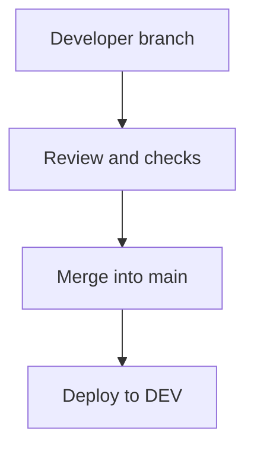

# Mermaid sizing

A small chart should keep its natural size on a wide page.

```mermaid
flowchart TD
    A[Developer branch] --> B[Review and checks]
    B --> C[Merge into main]
    C --> D[Deploy to DEV]
```

A fixed-width chart must still fit a narrow reader window.

```mermaid
%%{init: {"flowchart": {"useMaxWidth": false}}}%%
flowchart LR
    A[Select changes] --> B[Validate dependencies]
    B --> C[Approve complete scope]
    C --> D[Promotion PRs]
    D --> E[Build candidate]
    E --> F[Release QA]
    F --> G[Staging]
    G --> H[Production]
```
