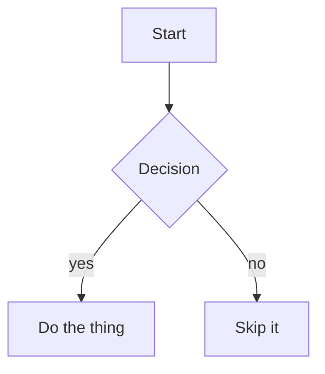

# Mermaid

A valid diagram:



An invalid diagram (must show the code block with an inline error note, never a
blank space):

```mermaid
graph TD
    A[Unclosed --> ???
    this is not valid mermaid
```
